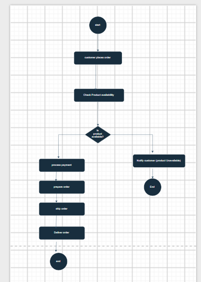

## E-Portfolio 2: Business Process Modelling

Business Process Modelling is used to visually represent how a
business process works. It helps organisations understand the
sequence of activities, decisions, responsibilities and interactions
within a process. Process modelling can also support process analysis,
communication and improvement.

## Introduction to Business Process Modelling

Business Process Modelling is the act of representing a business process in a graphical and standard way. like what they do, when they do it, the decisions they make along the way and the roles they perform. The artefact I have chosen is an academic report on Business Process Modelling. The article describes how process models enable an organisation to gain a better understanding of its own processes and to express the processes more accurately to others. It states modelling can also be utilised to analyse and improve existing business processes.

The reason I picked this artefact because it gave me a solid foundation for what Business Process Modelling was and what it was that organisations did with it. When I used to study this, I always thought that process modelling was just answering questions: What do I do? From this artefact I have learnt that a process view can also be adopted to look at problems, responsibilities and opportunities for process improvement. I found this artefact useful as it provided me with a footing onto which to build when tackling more complex models like BPMN. It is a significant testimony of what I have learnt because it illustrates how my perspectives of process modelling has expanded and that process modelling is more than just drawing process steps. 

## Business Process Model and Notation (BPMN)

Business Process Model and Notation, commonly known as BPMN, is a
standard method used to represent business processes visually. BPMN
uses different symbols to represent events, activities, decisions
and the flow between process steps. For example, circles can represent
events, rectangles can represent activities and diamonds can represent
gateways or decisions. The artefact I selected explains the main BPMN
symbols and demonstrates how they can be connected to create a process
model. It helped me understand how BPMN provides a common visual
language for describing business processes.

I selected this artefact because BPMN is an important part of Business
Process Modelling. I found the visual explanation particularly useful
because it made the different symbols easier to understand. I learned
that each BPMN symbol has a specific meaning and should be used
correctly when creating a process model. The gateway was especially
interesting to me because it shows how different paths can be followed
depending on a decision. This artefact is meaningful evidence of my
learning because it helped me move from understanding basic process
modelling to understanding a formal process modelling notation.

## Applying BPMN - My Own Process Model

For this artefact, I created my own BPMN model of an online shopping
order process. The process begins when the customer places an order.
The system then checks whether the selected product is available. A
gateway is used to represent the decision about product availability.
If the product is available, the process continues to payment, order
preparation, shipping and delivery. If the product is unavailable,
the customer is notified and the process ends. I used activities,
events, sequence flows and a gateway to represent the different parts
of the process.

I chose my own BPMN model as an artefact because it allowed me to
apply the concepts I learned from the previous artefacts. Creating
the diagram helped me understand where different BPMN elements should
be used and how the activities should be connected. I particularly
learned how gateways are used when a process contains more than one
possible path. Creating the model was useful because I had to think
about the process logically instead of only reading about BPMN.
This artefact is meaningful evidence of my learning because it
demonstrates that I can apply Business Process Modelling concepts
to a realistic business situation.

# Reflection

Through this e-portfolio, I developed a better understanding of
Business Process Modelling and how it is used to represent business
activities in a clear and structured way. I learned about BPMN
elements such as events, activities, gateways and sequence flows.
Creating my own online-order process model was particularly helpful
because I was able to apply these concepts practically. It also
helped me understand how modelling can identify decisions,
responsibilities and different paths within a business process.

# Conclusion

Overall, Business Process Modelling is an important part of Business
Process Management because it helps organisations understand,
communicate and improve their processes. The four artefacts helped
me develop my knowledge from understanding basic process modelling
concepts to applying BPMN in a practical example. This e-portfolio
has shown me that a well-designed process model can simplify complex
business activities and provide a useful foundation for analysing
and improving organisational processes.

# AI Use Acknowledgement
Generative AI was used during the planning and initial research
stage to help organise the structure of this e-portfolio and
generate ideas for suitable artefacts. The selected sources were
checked independently, and the final reflections were reviewed
and rewritten in my own words.

# Reference 
Hörner, L.F., Möller, M. & Reichert, M. 2026,
*Automatically Generating BPMN 2.0 Process Models from Natural Language
Process Descriptions: Challenges, Framework, Quality Assessment*,
Business & Information Systems Engineering, viewed 4 September 2026,
https://link.springer.com/article/10.1007/s12599-025-00983-x

Object Management Group (OMG) 2026, *Business Process Model and Notation (BPMN)*,
viewed 4 September 2026,https://www.omg.org/bpmn/
